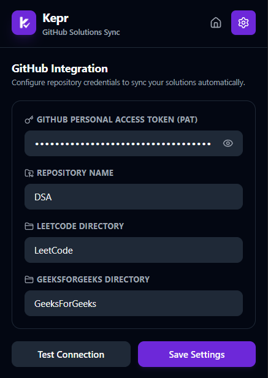

# Kepr

> Keep every solution.

Automatically sync accepted coding solutions, notes, and metadata to GitHub.


---

## Features

- **Multi-Platform Support**: Automatically detects and syncs solutions from both LeetCode and GeeksForGeeks (GFG).
- **GitHub Integration**: Direct communication with the GitHub API using personal access tokens (PAT) for custom repository sync paths.
- **Problem Notes**: Keep track of key findings, edge cases, and learnings by appending revision notes to each problem path.
- **Submission Metadata Tracking**: Captures and saves detailed runtime metrics, memory usage, language, difficulty, company tags (for GFG), timestamps, and other submission details in a structured `metadata.json` file.
- **Session Tracking**: Measures active focus time spent solving problems and stores it alongside each solution.
- **Local Storage Fallback**: Gracefully caches configuration and session data using Chrome storage to prevent data loss.
- **Modular Platform Abstraction**: Built on a platform-agnostic adapter architecture that makes adding new coding platforms simple.

---

## Why Kepr?

When practicing coding problems, it is surprisingly easy to lose track of previous solutions, revision notes, and learning progress. While coding platforms provide submission history, they are not designed to be a long-term, searchable archive of your journey.

Kepr acts as a background sync agent. When an accepted submission is detected, it captures your solution, metadata, notes, and activity information, then automatically commits everything to your personal GitHub repository. Over time, this creates a searchable, version-controlled archive of your coding progress.

---

## Installation

### 1. Download the Extension

- Visit the [Releases](https://github.com/ArNAB-0053/kepr/releases) page.
- Download the latest `kepr-<version>.zip` archive.
- Extract the archive locally.

### 2. Load the Extension

1. Open Chrome (or any Chromium-based browser).
2. Navigate to:

   ```
   chrome://extensions/
   ```

3. Enable **Developer Mode**.
4. Click **Load unpacked**.
5. Select the extracted extension folder.

### 3. Open Settings

Click the Kepr icon from the browser toolbar to open the settings panel.

---

## Configuration

Kepr requires a one-time setup before syncing solutions.

### Generate a GitHub Personal Access Token

1. Open GitHub Settings.
2. Navigate to:

   ```
   Developer Settings
   → Personal Access Tokens
   → Fine-grained Tokens
   ```

3. Create a token with repository content read/write permissions.

### Configure Repository

Enter your repository in the following format:

```text
owner/repository-name
```

Example:

```text
octocat/my-solutions
```

Click **Test Connection** to verify access.

### Configure Directories & Paths

Kepr automatically structures solutions by platform inside your repository:

- **LeetCode Directory**: Custom folder name for LeetCode solutions (default: `LeetCode`).
- **GeeksForGeeks Directory**: Custom folder name for GeeksForGeeks solutions (default: `GeeksForGeeks`).

#### Folder Structures

With **LeetCode Directory** = `LC` and **GeeksForGeeks Directory** = `GFG`:
```text
LC/
└── <problem-slug>/

GFG/
└── <problem-slug>/
```

Click **Save Settings** to persist the configuration.



---

## Development

Kepr is built with:

- Plasmo
- React
- TypeScript
- Tailwind CSS
- Chrome Extension APIs

### Prerequisites

- Node.js v22+
- pnpm

### Setup

Clone the repository:

```bash
git clone https://github.com/ArNAB-0053/kepr.git
cd kepr
```

Install dependencies:

```bash
pnpm install
```

Start the development server:

```bash
pnpm dev
```

Load the generated development build:

```text
build/chrome-mv3-dev
```

through Chrome's **Load unpacked** option.

### Production Build

Generate a production-ready extension:

```bash
pnpm build
```

Output:

```text
build/chrome-mv3-prod
```

This folder can be packaged and distributed manually or attached to GitHub Releases.

---

## Project Structure

```text
├── assets/                  # Logos, icons, screenshots, design assets
├── build/                   # Generated builds (ignored by Git)
├── src/
│   ├── background/          # Background service worker
│   ├── contents/            # Content scripts and page observers
│   ├── lib/
│   │   ├── constants/       # Shared constants
│   │   ├── github/          # GitHub API integration
│   │   ├── leetcode/        # Platform-specific logic
│   │   ├── storage/         # Chrome storage abstraction
│   │   └── types/           # TypeScript definitions
│   └── popup/               # Extension popup UI
├── package.json
└── tsconfig.json
```

---

## Roadmap

- Support additional coding platforms (Codeforces, HackerRank, etc. - LeetCode and GeeksForGeeks are supported!)
- Enhanced metadata tracking and analytics
- Repository bootstrap templates
- Progress dashboards and insights
- Better activity and revision tracking
- Cross-browser support

---

## Contributing

Contributions are welcome.

If you would like to contribute:

1. Fork the repository.
2. Create a feature branch.
3. Make your changes.
4. Submit a pull request.

Please use Conventional Commits whenever possible:

```text
feat: add Codeforces support
fix: prevent duplicate syncs
docs: improve installation guide
```

---

## License

This project is licensed under the MIT License. See [LICENSE](LICENSE) for details.
